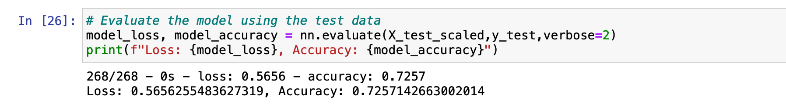
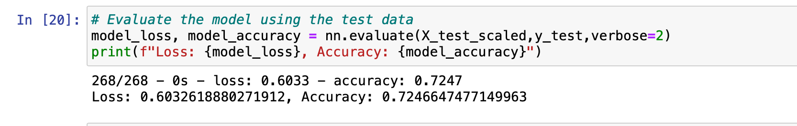

# Neural Network Charity Analysis

## Overview of the analysis:

In this project, with my knowledge of machine learning and neural networks, I used the features in the provided dataset to help Alphabet Soup create a binary classifier capable of predicting whether applicants will be successful if funded by Alphabet Soup.

## Results

### Data Preprocessing

- What variable(s) are considered the target(s) for your model?
 - It is the **IS_SUCCESSFUL** column.

- What variable(s) are considered to be the features for your model?
 - They are **APPLICATION_TYPE, AFFILIATION, CLASSIFICATION, USE_CASE, ORGANIZATION, STATUS, INCOME_AMT, SPECIAL_CONSIDERATIONS, ASK_AMT**.

- What variable(s) are neither targets nor features, and should be removed from the input data?
 - For this project, I removed the **EIN** and **NAME** columns since they only served as the identification columns.

### Compiling, Training, and Evaluating the Model

- How many neurons, layers, and activation functions did you select for your neural network model, and why?
  - For the first try, I used two hidden node layers (80 neurons for the first layer and 30 neurons for the second layer). Both of the hidden node layers used **Relu** activation function, whereas the output later used the **Sigmoid** activation function.

- Were you able to achieve the target model performance?
  - Unfortunately, the model was not able to achieve the target model performance (>75%). The result for my first try is a **72.57% accuracy score**.
  
  
  
- What steps did you take to try and increase model performance?
  - Second try: changed the "Other" bucket threshold for the **APPLCIATION_TYPE** column from 500 to 200.
  - Third try: changed the "Other" bucket threshold for the **CLASSIFICATION** column from 1800 to 500.
  - Fourth try: added a third hidden node layer with 80 neurons and "Relu" activation function. Also, increased the neurons for the first and second hidden layers to 130 and 100, respectively.
  - However, even with all of these changes, my accuracy score could not increase. In fact, it even lower my accuracy score to **72.45%**
  
  
  
## Summary

In conclusion, both of the two models could not meet the target model performance.  With that said, I would recommend choosing the first model since it yielded better results and executed much faster than the second model (optimization model). 

